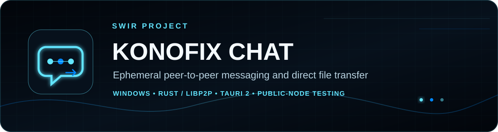
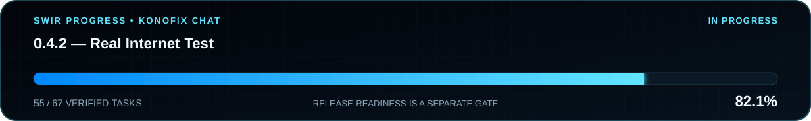

<!-- SWIR-README-STANDARD:v2 -->

<div align="center">



<br>

**Ephemeral peer-to-peer messaging and direct file transfer for Windows**

**No traditional accounts • Rust/libp2p networking • Tauri desktop UI • Public-Node test tooling**


[](https://github.com/Swir/Konofix/actions/workflows/windows-ci.yml)
[](https://github.com/Swir/Konofix/actions/workflows/linux-node-ci.yml)
[](https://github.com/Swir/Konofix/stargazers)
[](https://github.com/Swir/Konofix/releases/tag/v0.4.2-test1)

[**Highlights**](#highlights) · [**Quick Start**](#quick-start) · [**Architecture**](#architecture) · [**Roadmap**](#roadmap) · [**Releases**](#releases)

</div>


## Project status



**Development / controlled Internet testing**

**Verified checklist fraction: 54 of 59 tasks — 91.5%.** The generated SVG uses the exact checklist fraction. The text summary below is CI-checked against that same verified fraction.

**Real Internet Test milestone: 91.5% complete**

The active `0.4.2 — Real Internet Test` milestone has **54 of 59 tasks complete**. The remaining five tasks require real public-network evidence and fixes discovered during those tests. CI, local transport smoke tests, documentation work, or progress-graphic maintenance do not increase this percentage by themselves.

The current public package is **`v0.4.2-test1`**, a prerelease preview for controlled cross-country P2P testing. It predates some of the current exact-build Netprobe, soak-artifact and promotion-evidence hardening, so it must not be mixed with newer source/tooling when collecting promotion-quality evidence. It is not a declaration that the public-network milestone has passed.

## What is Konofix?

Konofix Chat is a desktop P2P messenger built around `rust-libp2p`. A user starts the app, chooses a nickname, joins the global `#WORLD` room, can create temporary rooms, and can transfer files directly to other peers after recipient approval.

Konofix does not use a traditional account, email address, or phone number. Public Konofix Nodes act as bootstrap / discovery / relay infrastructure; they are not central message-history or file-storage servers.

## Highlights

| Feature | What it provides |
|---|---|
| ⚡ Ephemeral identity | Join with a nickname instead of creating a traditional account. |
| 🌐 Global discovery | Kademlia DHT, Identify, mDNS, peer caching and bootstrap nodes help peers find each other. |
| 💬 Distributed rooms | Global `#WORLD` plus temporary user-created rooms. |
| 🔒 Authenticated transport | libp2p Noise transport identity plus source-bound GossipSub validation. |
| 📦 P2P file transfer | Recipient approval, 256 KiB chunks, cancellation, size limits and SHA-256 verification. |
| 🛰️ NAT traversal stack | AutoNAT, Circuit Relay, DCUtR, UPnP, TCP and QUIC-v1 support. |
| 🧭 Public Node tooling | Windows and Linux Node builds, readiness checks, health telemetry and soak validation. |
| 🧪 Evidence-driven release gate | Exact-build manifests, Netprobe evidence, provenance verification and fail-closed promotion checks. |
| 🌍 Localization | English, Polish, Norwegian, German, French, Spanish and Ukrainian UI with English fallback. |

## Quick Start

### Public preview

1. Open the [`v0.4.2-test1` release](https://github.com/Swir/Konofix/releases/tag/v0.4.2-test1).
2. Download `Konofix-Chat-0.4.2-test1-Windows.zip` and its `.sha256` file.
3. Verify the checksum before exploratory testing.
4. Extract the archive and follow its bundled instructions.

> `v0.4.2-test1` is an older prerelease preview and may trigger Windows SmartScreen because it is not commercially code-signed. Do **not** combine this archive with newer scripts, binaries, `BUILD_INFO.json`, Netprobe records or soak evidence for stable-promotion testing.

### Promotion-quality controlled testing

Use a **fresh Windows test bundle from a fully green `main` Windows CI run for the exact commit being tested**. Keep that bundle's `BUILD_INFO.json`, Node, Netprobe, scripts and evidence together. The promotion validators intentionally reject mixed commits, binaries, sessions and Node-soak provenance.

### From source

Requirements:

- Windows 11
- Node.js 22+
- Rust toolchain with MSVC target
- Tauri 2 build prerequisites for Windows

```powershell
git clone https://github.com/Swir/Konofix.git
cd Konofix
npm ci
npm run tauri dev
```

Run the repository validation path with:

```powershell
.\scripts\check.ps1
```

Build the production Windows application with:

```powershell
.\scripts\build-windows.ps1
```

The Tauri application bundle is written under `src-tauri\target\release\bundle`.

## Konofix Node

Build the Windows Node from the repository:

```powershell
build-node.bat
```

For a public/community Node, the verified Windows artifact includes a fail-closed launcher that validates the public endpoint and keeps persistent identity and health state separated:

```powershell
.\scripts\public-node.ps1 `
  -PublicHost node.yourdomain.com `
  -StateDirectory C:\Konofix `
  -RequireDnsResolution `
  -Start
```

For a supervised Node that survives logoff and reboot, use the bundled startup-task installer from an elevated PowerShell window:

```powershell
.\scripts\install-public-node-task.ps1 `
  -PublicHost node.yourdomain.com `
  -StateDirectory C:\ProgramData\KonofixNode `
  -RequireDnsResolution `
  -ConfigureFirewall `
  -Install `
  -StartNow
```

The raw Node remains available for operators who want explicit control:

```powershell
konofix-node.exe `
  --port 45555 `
  --public-host YOUR_PUBLIC_IP_OR_DNS `
  --identity-file C:\Konofix\node-identity.key `
  --health-file C:\Konofix\health.json
```

A public Node normally needs inbound **TCP 45555** and **UDP 45555**. See [`docs/NODE.md`](docs/NODE.md) and [`docs/NODE_SOAK.md`](docs/NODE_SOAK.md) for the operator and stable-promotion evidence flow.

## Real Internet test workflow

Before cross-country testing, validate the advertised TCP and QUIC bootstrap addresses against the same Node identity and fresh health snapshot:

```powershell
.\scripts\check-public-node-readiness.ps1 `
  -TcpBootstrap "/dns/node.yourdomain.com/tcp/45555/p2p/12D3KooW..." `
  -QuicBootstrap "/dns/node.yourdomain.com/udp/45555/quic-v1/p2p/12D3KooW..." `
  -HealthPath "C:\Konofix\node-health.json" `
  -ExpectedVersion "0.4.2" `
  -ExpectedSourceCommit "FULL_40_CHARACTER_COMMIT_SHA"
```

Then create the complete five-scenario exact-build workspace from the extracted verified Windows archive:

```powershell
.\scripts\new-network-test-session.ps1 `
  -ClientA "PC-A" -ClientACountry "Norway" -ClientANetwork "Operator-A LTE" `
  -ClientB "PC-B" -ClientBCountry "Poland" -ClientBNetwork "Operator-B LTE" `
  -TcpBootstrap "/dns/node.yourdomain.com/tcp/45555/p2p/PEER_ID" `
  -QuicBootstrap "/dns/node.yourdomain.com/udp/45555/quic-v1/p2p/PEER_ID"
```

The stable-promotion evidence path requires TCP, QUIC, Relay, DCUtR and CGNAT scenario manifests from one coherent session, exact artifact/source provenance, authenticated direct TCP+QUIC Netprobe records from both independent client contexts, concrete per-check evidence, file-transfer SHA-256 observations, and a continuous Node soak history sealed to the same exact Node binary and `BUILD_INFO.json` hashes. Session validation also rejects cross-directory manifest substitution.

Run the final evidence preflight with the `BUILD_INFO.json` from that same verified archive:

```powershell
.\scripts\check-promotion-evidence.ps1 `
  -BuildInfoPath .\BUILD_INFO.json `
  -SessionInfoPath .\test-results\konofix-real-network-...\SESSION_INFO.json `
  -NetworkEvidence .\test-results\konofix-real-network-...\network-test-*.json `
  -ClientNetprobeEvidence .\test-results\konofix-real-network-...\client-*-netprobe.json `
  -NodeSoakEvidence .\node-soak\*.json
```

See [`docs/TESTING.md`](docs/TESTING.md), [`docs/CLIENT_NETPROBE_EVIDENCE.md`](docs/CLIENT_NETPROBE_EVIDENCE.md), and [`docs/NODE_SOAK.md`](docs/NODE_SOAK.md) for the controlled test and promotion-evidence flow.

## Architecture

```text
Tauri 2 desktop UI / TypeScript 7 / Vite 8
                     │
                     ▼
              Rust application core
                     │
                     ▼
                 rust-libp2p
  ┌──────────┬──────────┬───────────┬──────────────┐
  │ TCP/QUIC │ GossipSub│ Kademlia  │ Request/Resp │
  │ Noise    │ presence │ DHT       │ file transfer│
  │ Yamux    │ chat     │ discovery │ CBOR         │
  └──────────┴──────────┴───────────┴──────────────┘
                     │
          AutoNAT / Relay / DCUtR / UPnP
```

The client also maintains a bounded local peer-address cache to improve reconnect attempts. Production Windows artifacts carry exact build provenance, dependency lockfiles, Node/Netprobe hashes and test tooling that are verified before upload.

## Security and trust boundaries

Konofix is designed to fail closed around release evidence and several P2P control paths, but the current stage still has important limits:

- `#WORLD` is a public distributed room. libp2p transport is encrypted, but this is **not** a private end-to-end encrypted direct-message feature.
- Private P2P/E2E conversations are planned for a later roadmap stage.
- Incoming file offers require approval; transfer control is bound to the requesting peer and received content is SHA-256 verified.
- Signed GossipSub payload identity must match the authenticated libp2p source before presence/chat/room/nickname state is accepted.
- Public-Node identity files and other secrets must never be published in test evidence or issue reports.
- A release is not promoted only because CI is green; real independent-network evidence remains mandatory.

Security reports should follow [`.github/SECURITY.md`](.github/SECURITY.md).

## Local data

| Data | Default location |
|---|---|
| Peer cache | `%LOCALAPPDATA%\Konofix Chat\peer-cache.json` |
| Default Node identity | `%LOCALAPPDATA%\Konofix Chat\node-identity.key` |
| Received files | `Downloads\Konofix Chat` |

An explicitly configured `--identity-file` overrides the default Node identity path.

## CI and release integrity

Windows CI validates the frontend, localization/project policy, Rust formatting, Clippy, all-target tests, locked dependency resolution, production Tauri/Node/Netprobe builds, runtime Node/transport smoke, staged bundle contents, ZIP/SHA-256 integrity and adversarial provenance checks.

Linux Node CI validates the isolated headless Node/Netprobe target, release build, provenance, systemd deployment constraints, persistent identity and authenticated TCP + QUIC-v1 runtime smoke without requiring desktop Tauri/WebKit dependencies.

Frontend resolution is pinned by `package-lock.json`; Rust resolution is pinned by `src-tauri/Cargo.lock`. GitHub Actions are pinned to immutable commit SHAs and checkout credentials are not persisted.

## Roadmap

The authoritative plan is [`ROADMAP.md`](ROADMAP.md).

Current gate: **0.4.2 — Real Internet Test**. The five open milestone items are deliberately real-world only:

- stable public/community Konofix Node,
- two PCs on independent networks in different countries,
- CGNAT ↔ public Node ↔ CGNAT test,
- TCP, QUIC, Relay and DCUtR verification,
- fixes discovered during real-world network tests.

After this milestone closes, the roadmap moves to **0.5.0 — Rooms 2.0**.

## Releases

The current public artifact is the [`v0.4.2-test1` prerelease](https://github.com/Swir/Konofix/releases/tag/v0.4.2-test1). It remains useful as a historical/exploratory preview, but promotion-quality evidence must use one exact fresh verified bundle and its matching provenance/tooling. A later GitHub Release should be published only after the repository release gates and required real public-network evidence pass.

Release history: [GitHub Releases](https://github.com/Swir/Konofix/releases)  
Change history: [`CHANGELOG.md`](CHANGELOG.md)

## Project structure

```text
src/                  TypeScript desktop UI and localization
src-tauri/            Rust/Tauri application and binaries
src-tauri/src/bin/    Konofix Node and Netprobe binaries
scripts/              CI, release, public-Node, progress and evidence tooling
node-linux/           Isolated headless Linux Node target
docs/                 Operator, testing and security documentation
.github/workflows/    Windows and Linux CI
assets/readme/         SWIR README PRO hero and generated progress SVGs
```

## 🔎 Search Keywords

`peer to peer messenger` • `p2p chat windows` • `rust libp2p chat` • `tauri messenger` • `decentralized chat app` • `p2p file transfer windows` • `libp2p circuit relay` • `dcutr hole punching` • `quic p2p messenger` • `kademlia dht chat` • `public bootstrap node` • `rust tauri windows app` • `cross network p2p test` • `cg-nat p2p testing`


<div align="center">

### `CONNECT • VERIFY • RELEASE • EVOLVE`

⭐ **If Konofix is useful, consider leaving a star.**

[**← SWIR profile**](https://github.com/Swir) · [**All projects →**](https://github.com/Swir?tab=repositories)

</div>
